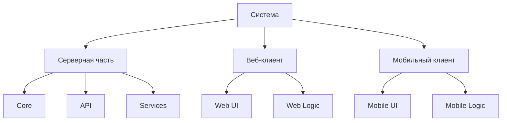

# Архитектура проекта

## Структура проекта

```
wildeberries-assistant/
├── server/                      # Серверная часть
│   ├── src/                     # Исходный код
│   │   ├── core/               # Ядро приложения
│   │   │   ├── domain/         # Доменная модель
│   │   │   │   ├── entities/   # Сущности
│   │   │   │   ├── values/     # Объекты-значения
│   │   │   │   └── events/     # События домена
│   │   │   ├── services/       # Сервисы домена
│   │   │   └── interfaces/     # Интерфейсы ядра
│   │   │
│   │   ├── infrastructure/     # Инфраструктура
│   │   │   ├── database/       # Работа с БД
│   │   │   │   ├── models/     # Модели БД
│   │   │   │   ├── migrations/ # Миграции
│   │   │   │   └── repositories/ # Репозитории
│   │   │   ├── cache/         # Кэширование
│   │   │   └── storage/       # Файловое хранилище
│   │   │
│   │   ├── api/               # API слой
│   │   │   ├── rest/         # REST API
│   │   │   │   ├── controllers/
│   │   │   │   ├── middleware/
│   │   │   │   └── routes/
│   │   │   └── websocket/    # WebSocket
│   │   │       ├── handlers/
│   │   │       └── managers/
│   │   │
│   │   ├── services/         # Сервисы приложения
│   │   │   ├── requests/     # Система реквестов
│   │   │   ├── wb/          # Интеграция с WB
│   │   │   ├── printing/    # Система печати
│   │   │   └── warehouse/   # Складской учет
│   │   │
│   │   └── utils/           # Утилиты
│   │
│   ├── config/              # Конфигурации
│   ├── tests/               # Тесты
│   └── docs/                # Документация API
│
├── web-client/             # Веб-клиент
│   ├── src/
│   │   ├── app/           # Ядро приложения
│   │   │   ├── store/     # Управление состоянием
│   │   │   ├── router/    # Маршрутизация
│   │   │   └── services/  # Сервисы
│   │   │
│   │   ├── modules/       # Модули
│   │   │   ├── auth/      # Авторизация
│   │   │   ├── warehouse/ # Управление складом
│   │   │   ├── orders/    # Управление заказами
│   │   │   ├── supplies/  # Управление поставками
│   │   │   ├── printing/  # Система печати
│   │   │   └── analytics/ # Аналитика
│   │   │
│   │   ├── shared/        # Общие компоненты
│   │   │   ├── components/
│   │   │   ├── hooks/
│   │   │   └── utils/
│   │   │
│   │   └── assets/        # Статические ресурсы
│   │
│   ├── public/            # Публичные файлы
│   └── tests/             # Тесты
│
├── mobile-client/         # Мобильное приложение
│   ├── lib/
│   │   ├── app/          # Ядро приложения
│   │   │   ├── blocs/    # Управление состоянием (BLoC)
│   │   │   ├── routes/   # Навигация
│   │   │   └── services/ # Сервисы
│   │   │
│   │   ├── modules/      # Модули
│   │   │   ├── auth/     # Авторизация
│   │   │   ├── orders/   # Сборка заказов
│   │   │   ├── warehouse/
│   │   │   └── printing/
│   │   │
│   │   ├── shared/       # Общие компоненты
│   │   │   ├── widgets/
│   │   │   ├── utils/
│   │   │   └── constants/
│   │   │
│   │   ├── native/       # Нативные модули
│   │   │   ├── scanner/
│   │   │   └── printer/
│   │   │
│   │   └── assets/       # Статические ресурсы
│   │
│   ├── android/          # Android специфичный код
│   ├── ios/             # iOS специфичный код
│   └── test/           # Тесты
│
└── shared/              # Общий код
    ├── types/          # Типы и интерфейсы
    ├── constants/      # Константы
    └── utils/          # Общие утилиты

```

## Описание ключевых директорий

### Серверная часть (server/)

#### core/
- Содержит основную бизнес-логику
- Независим от внешних зависимостей
- Определяет интерфейсы для инфраструктуры

#### infrastructure/
- Реализует интерфейсы ядра
- Содержит работу с БД, кэшем, файлами
- Включает внешние интеграции

#### api/
- REST и WebSocket endpoints
- Middleware и валидация
- Маршрутизация запросов

#### services/
- Реализация бизнес-процессов
- Интеграции с внешними сервисами
- Система реквестов и печати

### Веб-клиент (web-client/)

#### app/
- Инициализация приложения
- Управление состоянием
- Базовые сервисы

#### modules/
- Функциональные модули
- Каждый модуль содержит:
  - Компоненты
  - Логику
  - Роутинг
  - Стили

#### shared/
- Переиспользуемые компоненты
- Хуки
- Утилиты

### Мобильный клиент (mobile-client/)

#### app/
- Инициализация приложения
- Навигация
- Управление состоянием

#### modules/
- Функциональные модули
- Каждый модуль содержит:
  - Экраны
  - Компоненты
  - Логику
  - Стили

#### native/
- Нативные модули
- Интеграции с устройствами
- Специфичный код для платформ

### Общий код (shared/)
- Типы данных
- Константы
- Утилиты
- Общие интерфейсы

## Правила организации кода

1. **Модульность**
   - Каждый модуль независим
   - Четкие границы ответственности
   - Собственные тесты

2. **Именование**
   - Осмысленные имена
   - Единый стиль
   - Соответствие функционалу

3. **Импорты**
   - Относительные внутри модуля
   - Абсолютные между модулями
   - Группировка импортов

4. **Тестирование**
   - Тесты рядом с кодом
   - Отдельные e2e тесты
   - Тестовые утилиты в shared/

## 1. Общая структура

### 1.1 Компоненты системы


### 1.2 Взаимодействие компонентов
- **Синхронное взаимодействие**: REST API
- **Асинхронное взаимодействие**: WebSocket
- **Очереди**: Локальные очереди для операций
- **Кэширование**: Многоуровневое (память, диск, распределенное)

## 2. Серверная часть

### 2.1 Ядро (Core)
- **Доменная модель**
  - Сущности
  - Значения
  - Агрегаты
  - События домена

- **Бизнес-логика**
  - Сервисы домена
  - Политики
  - Валидаторы
  - Фабрики

- **Инфраструктура**
  - Репозитории
  - Провайдеры
  - Адаптеры
  - Маппинги

### 2.2 API Layer
- **REST API**
  - Контроллеры
  - Middleware
  - Валидация
  - Маршрутизация

- **WebSocket**
  - Менеджер соединений
  - Обработчики событий
  - Broadcast система
  - Heartbeat

- **Безопасность**
  - Аутентификация
  - Авторизация
  - Защита от атак
  - Аудит

### 2.3 Сервисы
- **Система реквестов**
  - Менеджер реквестов
  - Обработчики типов
  - Маршрутизация
  - Мониторинг

- **Интеграция с WB**
  - API клиент
  - Кэширование
  - Retry политики
  - Синхронизация

- **Система печати**
  - Очередь печати
  - Драйверы принтеров
  - Шаблоны
  - Мониторинг

- **Складской учет**
  - Управление товарами
  - Управление ячейками
  - Инвентаризация
  - Оптимизация

### 2.4 Хранение данных
- **База данных**
  - Основная схема
  - Миграции
  - Индексы
  - Оптимизация

- **Кэширование**
  - In-memory кэш
  - Распределенный кэш
  - Инвалидация
  - Политики

- **Файловое хранилище**
  - Документы
  - Изображения
  - Логи
  - Бэкапы

## 3. Веб-клиент

### 3.1 Архитектура
- **Модульная структура**
  - Ядро приложения
  - Функциональные модули
  - Shared компоненты
  - Утилиты

- **Управление состоянием**
  - Локальное состояние
  - Глобальное состояние
  - Кэширование
  - Синхронизация

### 3.2 Модули
- **Авторизация**
  - Вход/выход
  - Управление сессией
  - Права доступа
  - Профиль

- **Управление складом**
  - Товары
  - Ячейки
  - Инвентаризация
  - Оптимизация

- **Управление заказами**
  - Список заказов
  - Детали заказа
  - Сборка
  - Статистика

- **Управление поставками**
  - Создание поставок
  - Управление коробами
  - Документы
  - Отслеживание

- **Система печати**
  - Управление принтерами
  - Очередь печати
  - Шаблоны
  - История

- **Аналитика**
  - Дашборды
  - Отчеты
  - Метрики
  - Графики

### 3.3 Инфраструктура
- **API клиент**
  - REST клиент
  - WebSocket клиент
  - Обработка ошибок
  - Retry логика

- **Роутинг**
  - Маршрутизация
  - Защита маршрутов
  - Breadcrumbs
  - История

- **UI компоненты**
  - Базовые компоненты
  - Формы
  - Таблицы
  - Модальные окна

## 4. Мобильный клиент

### 4.1 Архитектура
- **Модульная структура**
  - Ядро приложения
  - Функциональные модули
  - Shared компоненты
  - Нативные модули

- **Управление состоянием**
  - Локальное состояние
  - Глобальное состояние
  - Offline хранилище
  - Синхронизация

### 4.2 Модули
- **Авторизация**
  - Вход/выход
  - Управление сессией
  - Биометрия
  - Профиль

- **Сборка заказов**
  - Список заданий
  - Процесс сборки
  - Сканирование
  - Подтверждение

- **Работа со складом**
  - Поиск товаров
  - Размещение
  - Перемещение
  - Инвентаризация

- **Печать**
  - Подключение к принтерам
  - Печать этикеток
  - Очередь печати
  - Ошибки

### 4.3 Offline режим
- **Локальное хранилище**
  - Структура данных
  - Индексация
  - Очистка
  - Миграции

- **Синхронизация**
  - Очередь операций
  - Разрешение конфликтов
  - Стратегии синхронизации
  - Мониторинг

### 4.4 Нативные интеграции
- **Сканер**
  - Камера
  - Внешние сканеры
  - Обработка штрих-кодов
  - Валидация

- **Принтеры**
  - Bluetooth
  - Wi-Fi
  - Драйверы
  - Очереди

## 5. Интеграции

### 5.1 Wildberries API
- **Авторизация**
  - Управление токенами
  - Обновление токенов
  - Мониторинг
  - Безопасность

- **Заказы**
  - Получение заказов
  - Обновление статусов
  - Стикеры
  - Отмены

- **Поставки**
  - Создание
  - Управление
  - QR-коды
  - Документы

### 5.2 Принтеры
- **Протоколы**
  - TCP/IP
  - Bluetooth
  - USB
  - Специфичные протоколы

- **Форматы**
  - PDF
  - ZPL
  - EPL
  - Изображения

## 6. Безопасность

### 6.1 Аутентификация
- **Методы**
  - JWT
  - Сессии
  - OAuth
  - Биометрия

- **Защита**
  - Хэширование
  - Шифрование
  - Rate limiting
  - Блокировки

### 6.2 Авторизация
- **Роли**
  - Определение ролей
  - Права доступа
  - Наследование
  - Ограничения

- **Контроль**
  - Проверка прав
  - Аудит действий
  - Логирование
  - Мониторинг

## 7. Мониторинг

### 7.1 Метрики
- **Системные**
  - Производительность
  - Ресурсы
  - Ошибки
  - Доступность

- **Бизнес**
  - Заказы
  - Сборка
  - Эффективность
  - KPI

### 7.2 Логирование
- **Уровни**
  - Error
  - Warning
  - Info
  - Debug

- **Аспекты**
  - Безопасность
  - Производительность
  - Бизнес-операции
  - Интеграции 