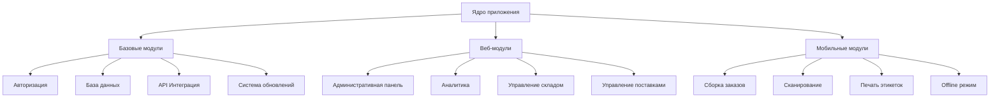

# Техническая логика приложения

## 1. Архитектура системы

### 1.1 Компоненты системы
| Компонент | Описание | Платформа |
|-----------|----------|-----------|
| Веб-клиент | Интерфейс для менеджеров и администраторов | Web |
| Мобильный клиент | Приложение для сборщиков и работников склада | Mobile |
| Серверная часть | API и бизнес-логика | Server |
| Система обновлений | Механизм распространения обновлений | Cross-platform |

### 1.2 Модульная структура

## 2. Система распространения

### 2.1 Модель подписки
| Тип | Описание | Доступ | Платформа |
|-----|-----------|--------|-----------|
| Базовая | Полный доступ | Полный | Mobile + Web Full |
| Enterprise | Корпоративные функции | Полный + API | All + Custom |

### 2.2 Система обновлений
- Автоматическая проверка версий
- Поэтапное развертывание
- Откат при ошибках
- Changelog для пользователей
- Разделение обновлений по платформам
- Принудительные обновления для критических изменений

### 2.3 Распространение приложений
- !!! Решения для релиза 1.0
  - Мобильное приложение
    - Android: Google Play vs Прямая установка
    - iOS: App Store vs PWA
    - Система обновлений и распространения
  - Статус: Требует решения перед релизом
  - Приоритет: Средний

### 2.4 !!! Размещение веб-клиентов
- !!! Решения для релиза 1.0
  - Варианты размещения
    - Собственный сервер
    - Облачный хостинг
  - Статус: Требует решения перед релизом
  - Приоритет: Средний
  - Зависит от:
    - Анализа нагрузки
    - Требований к доступности
    - Бюджета на инфраструктуру
    - Технических требований

## 3. Разграничение функционала

### 3.1 Веб-платформа (Управление)
- Административные функции
  - Управление пользователями
  - Настройка системы
  - Интеграция с API
- Управление складом
  - Контроль остатков
  - Планирование поставок
  - Управление ячейками
  - Приемка новых товаров
    - Создание приемки
    - Контроль качества
    - Размещение по ячейкам
  - Инвентаризация
    - Планирование инвентаризации
    - Назначение сотрудников
    - Обработка расхождений
- Система печати
  - Управление принтерами
    - Добавление и настройка принтеров
    - Назначение принтеров сборщикам
    - Мониторинг состояния принтеров
  - Управление этикетками
    - Массовая печать стикеров
    - Настройка шаблонов
    - История печати
- Управление поставками
  - Работа с поставками WB
    - Создание поставок
    - Управление коробами
    - Печать QR-кодов и стикеров
    - Управление пропусками на склад WB
  - !!! Автоматическая сборка поставок (требует уточнения)
    - Критически важный компонент
    - Правила формирования поставок
    - Зависит от данных API Wildberries
    - Требуется анализ API возможностей
  - Контроль сборки
    - Отслеживание прогресса
    - Подтверждение завершения
  - Подготовка документов
    - Сопроводительные документы
    - Пропуска на склад WB
    - Этикетки для коробов
- Система расчета ЗП
  - Конструктор правил расчета
    - Базовая ставка
    - Бонусы за выполнение KPI
    - Штрафы за ошибки
  - Настройка периодов
    - Дневная смена
    - Ночная смена
    - Праздничные дни
  - Формулы расчета
    - По количеству заказов
    - По времени работы
    - По сложности товаров
  - Автоматический расчет
    - Ежедневный
    - Еженедельный
    - Ежемесячный
- Аналитика и отчеты
  - Статистика работы
    - Общие показатели
    - KPI отделов
  - Эффективность сборщиков
    - Время работы/простоя
    - Среднее время на заказ
    - Количество собранных заказов
    - Расчет сдельной оплаты
  - Финансовые показатели
- Мониторинг процессов
  - Отслеживание заказов
  - Контроль сборки
  - Логирование действий

### 3.2 Мобильное приложение (Исполнение)
- Управление статусом
  - Начало/конец смены
  - Установка перерыва
  - Статус занятости
- Сборка заказов
  - Получение заданий
  - Сканирование товаров
  - Подтверждение сборки
- Работа со складом
  - Приемка товаров
  - Размещение по ячейкам
  - Инвентаризация
- Печать документов
  - Быстрая печать этикеток
    - Печать для текущего заказа
    - Выбор назначенного принтера
  - Управление очередью печати
    - Просмотр статуса
    - Отмена печати
- Offline функционал
  - Кэширование данных
  - Синхронизация
  - Автономная работа

### 3.3 Система реквестов (запросов)

#### 3.3.1 Общие принципы
- **Назначение**
  - Асинхронное взаимодействие между управляющими и исполнителями
  - Отслеживание статуса выполнения задач
  - Контроль качества работы
  - История действий и изменений

- **Структура реквеста**
  - Уникальный идентификатор
  - Тип запроса
  - Приоритет
  - Статус
  - Создатель запроса
  - Исполнитель
  - Время создания/изменения
  - Данные запроса
  - История изменений

#### 3.3.2 Типы реквестов
- **Складские операции**
  - Приемка товара
  - Перемещение товара
  - Инвентаризация
  - Списание

- **Сборка заказов**
  - Назначение сборщика
  - Начало сборки
  - Подтверждение сборки
  - Отмена сборки

- **Поставки**
  - Создание поставки
  - Добавление заказов
  - Печать документов
  - Закрытие поставки

#### 3.3.3 Жизненный цикл реквеста
- **Статусы**
  - Создан
  - Назначен
  - В работе
  - Требует проверки
  - Завершен
  - Отменен
  - Отклонен

- **Переходы статусов**
  - Создан → Назначен (при выборе исполнителя)
  - Назначен → В работе (при начале выполнения)
  - В работе → Требует проверки (при завершении работы)
  - Требует проверки → Завершен (при успешной проверке)
  - Любой статус → Отменен (при отмене)
  - Требует проверки → Отклонен (при обнаружении ошибок)

#### 3.3.4 Приоритизация
- **Уровни приоритета**
  - Критический (требует немедленного выполнения)
  - Высокий (выполнить в первую очередь)
  - Средний (стандартный приоритет)
  - Низкий (выполнить при возможности)

- **Факторы приоритизации**
  - Срочность заказа
  - Тип операции
  - Время создания
  - Текущая загрузка

#### 3.3.5 Контроль и мониторинг
- **Метрики**
  - Время выполнения
  - Количество ошибок
  - Эффективность исполнителей
  - Распределение по типам

- **Уведомления**
  - Новые назначения
  - Изменение статуса
  - Просроченные задачи
  - Критические ошибки

#### 3.3.6 Оптимизация
- **Автоматическое назначение**
  - На основе загрузки исполнителей
  - Учет специализации
  - Балансировка нагрузки
  - Приоритизация задач

- **Группировка реквестов**
  - По типу операции
  - По зоне склада
  - По исполнителю
  - По приоритету

## 4. Модульная архитектура

### 4.1 Базовые модули (Core)
- Авторизация и безопасность
  - JWT авторизация
  - Ролевой доступ
  - Аудит действий
- Интеграция с Wildberries
  - API клиент
    - Управление заказами
    - Управление поставками
    - Получение стикеров
    - Работа с QR-кодами
  - !!! Анализ возможностей API (требует уточнения)
    - Автоматическая сборка поставок
    - Группировка заказов
    - Оптимизация логистики
  - Синхронизация данных
    - Статусы заказов
    - Статусы поставок
    - Остатки товаров
  - Обработка ошибок
    - Повторные попытки
    - Логирование ошибок
    - Уведомления об ошибках
- Система хранения
  - База данных
  - Кэширование
  - Файловое хранилище
- Общие утилиты
  - Логирование
  - Конфигурация
  - Валидация

### 4.2 Веб-модули
- Административный модуль
  - Управление пользователями
  - Настройка системы
  - Мониторинг
- Складской модуль
  - Управление товарами
  - Контроль остатков
  - Планирование
- Аналитический модуль
  - Сбор метрик
  - Генерация отчетов
  - Визуализация данных

### 4.3 Мобильные модули
- Модуль сборки
  - Управление заданиями
  - Сканирование
  - Подтверждение
- Складской модуль
  - Приемка
  - Размещение
  - Инвентаризация
- Печать и документы
  - Генерация этикеток
  - Управление принтером
  - Очередь печати

## 5. Технический стек

### 5.1 Серверная часть
| Компонент | Технологии |
|-----------|------------|
| Backend | Node.js, Express |
| Database | PostgreSQL |
| Cache | Redis |
| Queue | RabbitMQ |
| Storage | MinIO |

### 5.2 Клиентская часть
| Платформа | Технологии | Особенности |
|-----------|------------|-------------|
| Web | React, TypeScript | SPA, SSR |
| Mobile | React Native | Offline-first |
| Desktop | Electron | Опционально |

### 5.3 Инфраструктура
| Компонент | Технологии |
|-----------|------------|
| Deployment | Docker, K8s |
| CI/CD | GitLab CI |
| Monitoring | Prometheus + Grafana |
| Logging | ELK Stack |

### 5.4 Мониторинг и аналитика (Grafana)
- Операционные дашборды
  - Метрики производительности
    - Время ответа API
    - Загрузка серверов
    - Статус сервисов
  - Бизнес-метрики
    - Количество заказов в работе
    - Скорость сборки
    - Эффективность сборщиков
- Аналитические дашборды
  - Эффективность персонала
    - Время работы
    - Выполнение KPI
    - Статистика ошибок
  - Складская аналитика
    - Загруженность зон
    - Оборачиваемость товаров
    - Статистика инвентаризаций
- Системные дашборды
  - Мониторинг инфраструктуры
    - Состояние серверов
    - Сетевая активность
    - Использование ресурсов
  - Мониторинг приложений
    - Логи ошибок
    - Трейсинг запросов
    - Статус интеграций

## 6. Развертывание и обновление

### 6.1 Этапы развертывания
- **Локальное тестирование**
  - Развертывание на локальном сервере разработки
  - Функциональное тестирование
  - Интеграционное тестирование
  - Тестирование производительности

- **Тестирование на предприятии**
  - Развертывание на тестовом сервере предприятия
  - Тестирование в реальных условиях
  - Обучение персонала
  - Сбор обратной связи

- **Промышленная эксплуатация**
  - Развертывание на производственном сервере
  - Мониторинг производительности
  - Поддержка пользователей
  - Сбор метрик использования

### 6.2 Процедуры обновления
- **Подготовка обновления**
  - Создание резервной копии данных
  - Проверка совместимости версий
  - Подготовка скриптов миграции
  - Тестирование процедуры обновления

- **Процесс обновления**
  - Уведомление пользователей
  - Остановка сервисов
  - Применение обновлений
  - Миграция данных
  - Запуск и проверка сервисов

- **Откат изменений**
  - Критерии для отката
  - Процедура отката
  - Восстановление данных
  - Уведомление пользователей

### 6.3 Распространение приложений
- **Серверная часть**
  - Развертывание на личном сервере
  - Настройка SSL-сертификатов
  - Конфигурация брандмауэра
  - Мониторинг доступности

- **Мобильное приложение**
  - Распространение APK через личный сервер
  - Система проверки обновлений
  - Механизм автоматического обновления
  - Валидация целостности

- **Веб-клиент**
  - Развертывание на сервере предприятия
  - Настройка доступа
  - Кэширование статических ресурсов
  - Оптимизация производительности

### 6.4 Мониторинг развертывания
- **Метрики развертывания**
  - Время развертывания
  - Успешность обновлений
  - Количество откатов
  - Проблемы совместимости

- **Оповещения**
  - Критические ошибки
  - Проблемы с миграцией
  - Сбои в работе сервисов
  - Проблемы с доступностью

## 7. Синхронизация данных

### 7.1 Offline-режим
- **Локальное хранилище**
  - Структура локальной базы данных
  - Приоритеты кэширования данных
  - Управление хранилищем
  - Очистка устаревших данных

- **Механизмы синхронизации**
  - Двусторонняя синхронизация
  - Разрешение конфликтов
  - Очередь изменений
  - Валидация данных

### 7.2 Стратегии синхронизации
- **При подключении к сети**
  - Проверка состояния соединения
  - Определение приоритетов синхронизации
  - Пакетная передача данных
  - Обработка ошибок передачи

- **Периодическая синхронизация**
  - Интервалы синхронизации
  - Проверка изменений
  - Оптимизация трафика
  - Контроль нагрузки

### 7.3 Разрешение конфликтов
- **Типы конфликтов**
  - Параллельные изменения
  - Устаревшие данные
  - Несовместимые изменения
  - Отсутствующие зависимости

- **Стратегии разрешения**
  - Приоритет серверных данных
  - Слияние изменений
  - Сохранение истории
  - Уведомление пользователя

### 7.4 Мониторинг синхронизации
- **Метрики**
  - Успешность синхронизации
  - Время синхронизации
  - Объем данных
  - Количество конфликтов

- **Диагностика**
  - Логирование процесса
  - Отслеживание ошибок
  - Анализ производительности
  - Оптимизация процесса 